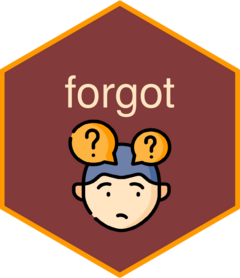

<!-- README.md is generated from README.Rmd. Please edit that file -->

```{r, include = FALSE}
knitr::opts_chunk$set(
  collapse = TRUE,
  comment = "#>",
  fig.path = "man/figures/README-",
  out.width = "100%"
)
```

# forgot 

<!-- badges: start -->
<!-- badges: end -->

The goal of forgot is to help you search for that one function you need in that one package. This package is based on functions from [Rd2roxygen](https://github.com/yihui/Rd2roxygen). The `forgot()` function returns a tibble of section content in R documentation files from a specified package (that's  already installed). You can search on this tibble and return an interactive HTML table if needed. There's also a RStudio Addin included that you can use to search package documentation in a small Shiny app. `forgot2()` is for more casual use and will return a simple version of the forgot tibble with just the first two columns by default.

This package provides an alternative to function search without using the help system (`?help()`) in the RStudio IDE. You should still use that though for learning purposes.

## Installation

You can install the development version of forgot like so:

``` r
# install.packages("devtools")
devtools::install_github("parmsam/forgot")
```

## Examples

This are examples which show you how to solve common problems:

Create a forgot tibble that has columns for doc sections in package functions
```{r example, eval = T, message = F}
library(forgot)
library(dplyr)
## basic example code
functions_in_pkg <- forgot("stringr")
functions_in_pkg %>% 
  select(function_name, title, desc) %>%
  head()
```

Search for a keyword of interest in the forgot tibble
```{r}
forgot("stringr", keyword = "count")
```

Or search for a keyword of interest only on specific fields
```{r}
forgot("stringr", keyword = "count", selected = c("title", "desc"))
```

If you want to search across multiple packages, here's an example of how you can use purrr to help with that
```{r eval = FALSE}
library(purrr)
c("stringr", "dplyr") %>%
  purrr::set_names() %>%
  map(forgot, keyword = "count") %>%
  list_rbind(names_to = "Package")
```

Lastly, here's how you can get a reactable HTML table that you can search on
```{r eval= F}
forgot("stringr", keyword = "count", selected = c("title", "desc"),
               interactive = T)
```

### Cat a roxygen2 field of interest into your R console

Here's how you can cat (?`cat()` for more info) the parameter field, usage field, or example field. Try it out to see how it looks.
```{r eval = F}
forgot_params("dplyr", "count")
forgot_usage("dplyr", "count")
forgot_exmpls("dplyr", "count")
```

## Credits

- Hex icon created using the [hexmake
  app](https://connect.thinkr.fr/hexmake/) from
  [ColinFay](https://github.com/ColinFay/hexmake).
- <a href="https://www.flaticon.com/free-icons/confusion" title="confusion icons">Confusion icons created by Freepik - Flaticon</a>
