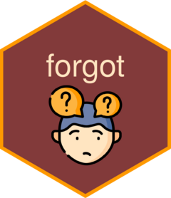

<!-- README.md is generated from README.Rmd. Please edit that file -->

# forgot 

<!-- badges: start -->
<!-- badges: end -->

The goal of forgot is to help you search for that one function you need
in that one package. This package is based on functions from
[Rd2roxygen](https://github.com/yihui/Rd2roxygen).

## Installation

You can install the development version of forgot like so:

``` r
# install.packages("devtools")
devtools::install_github("parmsam/forgot")
```

## Example

This is a basic example which shows you how to solve a common problem:

``` r
library(forgot)
library(dplyr)
## basic example code
functions_in_pkg <- forgot::forgot("stringr")
functions_in_pkg %>% 
  select(function_name, title, desc) %>%
  head()
#> # A tibble: 6 × 3
#>   function_name title                                                      desc 
#>   <chr>         <chr>                                                      <chr>
#> 1 case          Convert string to upper case, lower case, title case, or … "\n\…
#> 2 invert_match  Switch location of matches to location of non-matches      "\nI…
#> 3 modifiers     Control matching behaviour with modifier functions         "\nM…
#> 4 %>%           Pipe operator                                              "\nP…
#> 5 str_c         Join multiple strings into one string                      "\n\…
#> 6 str_conv      Specify the encoding of a string                           "\nT…
```
